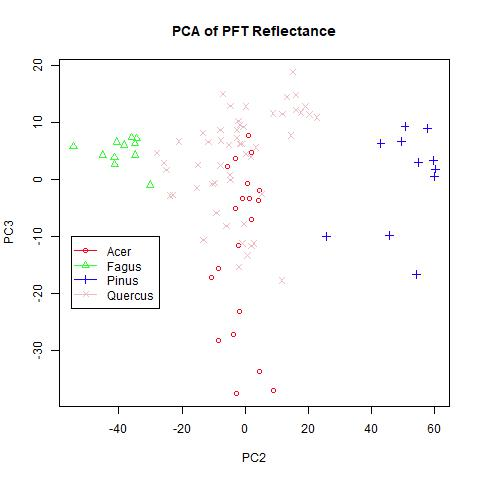
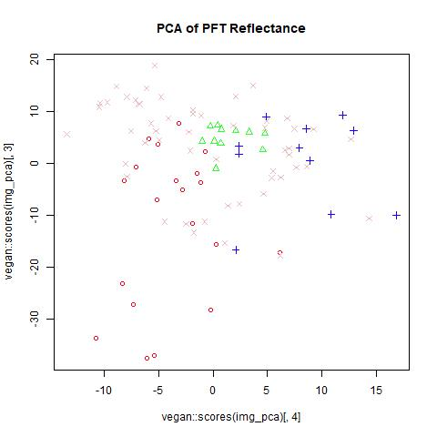

```{r setup, include=FALSE}
knitr::opts_chunk$set(echo = FALSE)
#source("./Functions/lecospectR.R")
#require(maptiles)
#require(terra)
#require(sf)
#library(rgdal)
#library(tidyverse)
#library(sf)
#require(stars)
```

## Paint rock tree leaf level spectral analysis
### Leaf level spectra summaries by treespecies showing 
Figure shows interquartile range (75%, dark grey) and 95% (light grey), with median reflectance 
as the solid line. Back ground shows Sentinel-2 bands with the respective visible color bands for reference.


### Principle Components Analysis (PCA) of tree leaf-level spectra
Separation of trees on the first two axes shows some separation but also much overlap.
Screeplot of PCA showed the first 4 axes accounting for 99% of the variation in the data.

#### PCA axess 1 vs 2


#### PCA axess 2 vs 3


#### PCA axess 1 vs 3


#### PCA axess 3 vs 4

